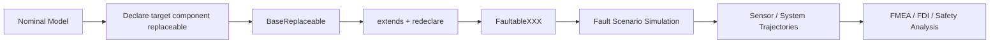

# FaultReplacementLibrary

**A Modelica library for component-replacement-based fault injection, fault-effect simulation, and simulation-driven safety / fault-diagnosis research.**

> **核心思想：Replace behavior, not topology.**  
> 尽量保持名义系统的连接拓扑与系统级模型不变，通过 Modelica 的 `replaceable` / `redeclare` 机制，在故障场景层替换目标组件的物理行为。

[](https://github.com/Ruizhe-Yang/FaultReplacementLibrary)
[](https://modelica.org/)
[](https://openmodelica.org/)
[](LICENSE)

---

## What is this project?

`FaultReplacementLibrary` provides fault-enabled alternatives to components used in the **Modelica Standard Library (MSL) 4.0.0**.

Instead of embedding fault logic throughout a nominal system model, the library isolates fault behavior inside `FaultableXXX` components and injects faults through **component redeclaration**.

The intended workflow is:



In practical terms:

| Kept unchanged | Changed in a fault scenario |
|---|---|
| System-level `connect()` topology | Target component implementation |
| Component position in the system | `faultMode` |
| Most nominal parameters | `severity` |
| Other subsystem models | Fault timing / transition parameters |

This makes the library useful for studying **fault effects without rebuilding the complete system model for every failure case**.

---

## Current status — v0.5.0

**v0.5.0 is a usable alpha release**: the replacement architecture, multi-domain fault components, benchmark examples, and validation workflow are already usable for research and engineering experiments, while the public API and physical fault calibration are still evolving.

Project audit snapshot, **2026-08-09**:

| Item | Current status |
|---|---:|
| Top-level `model` / `block` classes | 378 |
| Fault-enabled components | 141 |
| Non-`Normal` fault modes | 681 |
| `checkModel` | 378 / 378 |
| Baseline benchmark observations | 37 / 37 |
| Five-level system fault scenarios | 21 / 21 |
| Primary validated environment | OpenModelica 1.25.5 + MSL 4.0.0 |

> **Scientific caution / 科学性说明：** these numbers demonstrate model consistency and the current regression-test coverage. They do **not** mean that all 681 fault modes have been calibrated against real hardware degradation data or certified for safety-critical engineering use.

---

## For Modelica users: how replacement works

The core mechanism is standard Modelica inheritance and redeclaration.

### 1. Expose the target component as replaceable

```modelica
replaceable Modelica.Electrical.Analog.Basic.Capacitor C3(
  C=c3,
  v(start=0, fixed=true))
  constrainedby Modelica.Electrical.Analog.Interfaces.OnePort;
```

The target component remains part of the nominal system and is connected normally.

### 2. Create a fault scenario by inheritance

```modelica
model CapacitanceLoss
  extends BaseReplaceable(
    redeclare
      FaultReplacementLibrary.Electrical.Analog.Basic.FaultableCapacitor C3(
        C=c3,
        v(start=0, fixed=true),
        faultMode=
          FaultReplacementLibrary.Electrical.Analog.Basic.FaultableCapacitor
            .FaultMode.CapacitanceLoss,
        severity=scenarioSeverity,
        faultStartTime=2,
        transitionTime=0.1,
        C_loss=0.1682));

  parameter Real scenarioSeverity(min=0, max=1)=1;
end CapacitanceLoss;
```

The inherited system topology is reused. Only the implementation behind the instance `C3` is replaced.

A representative benchmark is:

```text
FaultReplacementLibrary.Examples.Benchmarks.Electrical.
CauerLowPassAnalog.CapacitanceLoss
```

Try changing:

```text
scenarioSeverity = 0, 0.25, 0.5, 0.75, 1
```

and compare the resulting system trajectories.

### Design principle

The library aims for:

```text
Nominal system model
        +
small replaceable boundary
        +
external fault scenario
        =
fault-injected system
```

rather than:

```text
Nominal equations
+ many embedded "if fault then ..." branches
```

This separation is especially useful when the nominal model and the safety-analysis model are maintained by different engineers.

---

## For fault diagnosis, PHM, and safety-analysis researchers

This repository is **not itself a fault-diagnosis algorithm**.

Instead, it can serve as a **physics-based fault injection and labeled-data generation layer** for fault detection and diagnosis (FDI), prognostics and health management (PHM), and simulation-driven safety analysis.

A typical workflow is:

1. Build or reuse a nominal multi-domain Modelica system.
2. Select one or more replaceable components.
3. Inject a known `faultMode`.
4. Sweep `severity`, fault onset time, duration, and transition time.
5. Record available sensor, telemetry, controller, or system-level variables.
6. Compare nominal and faulty trajectories.
7. Use the resulting labeled data for:
   - residual generation and threshold design;
   - model-based fault detection and isolation;
   - observer or estimator evaluation;
   - diagnostic feature engineering;
   - machine-learning training / validation data;
   - FMEA severity and detectability evidence;
   - fault-propagation and system-safety studies.

The simulation therefore provides explicit **ground truth**:

```text
fault location
+ fault mode
+ severity
+ onset time
+ physical system response
```

which can be compared with the information that a diagnostic algorithm actually observes through sensors.

---

## Fault semantics

Most fault-enabled components expose a common scenario vocabulary where applicable:

- `faultMode`
- `severity` in `[0, 1]`
- `faultStartTime`
- `faultEndTime`
- `transitionTime`

Many degradation modes can be interpreted through an activation factor \(a(t)\in[0,1]\), for example:

\[
\theta_{\mathrm{eff}}(t)
=
\theta_{\mathrm{nom}}
+
a(t)
\left(
\theta_{\mathrm{fault}}-\theta_{\mathrm{nom}}
\right)
\]

However, **not every physical fault is forced into one generic equation**. Open circuits, short circuits, leakage, friction changes, sensor faults, and other domain-specific failures may require different constitutive equations.

### About `Normal` and `severity = 0`

The design goal is nominal or numerically transparent behavior when the fault is inactive.

Some fault modes use finite numerical approximations (for example finite resistance/conductance for open/short-circuit behavior) to preserve a solvable fixed topology. Therefore, **do not assume that every inactive fault mode is algebraically identical to the original MSL equation**. Equivalence should be interpreted according to the corresponding component documentation and validation tolerance.

This distinction is intentional and important for reproducible simulation studies.

---

## Multi-domain scope

Current fault-enabled models cover major Modelica domains, including:

- **Electrical**
- **Mechanics**
- **Fluid**
- **Thermal**
- **Magnetic**
- **Blocks / signal-processing components**

Representative fault mechanisms include:

- parameter drift and performance degradation;
- capacitance / resistance / inductance changes;
- leakage increase;
- finite open-circuit and short-circuit approximations;
- friction, damping, stiffness, or efficiency degradation;
- actuator and transmission faults;
- fluid-component degradation;
- thermal-parameter degradation;
- sensor / signal bias, drift, gain, and related faults.

The project intentionally keeps fault physics close to the affected component instead of introducing a single universal `FaultBase` equation for all domains.

---

## Repository structure

```text
FaultReplacementLibrary/
├── Electrical/
├── Mechanics/
├── Fluid/
├── Thermal/
├── Magnetic/
├── Blocks/
│
├── Examples/
│   └── Benchmarks/          # MSL-derived system benchmarks and fault scenarios
│
└── Tests/
    ├── BaselineEquivalence/ # nominal / replaceable baseline comparison
    └── Replacement/         # component-replacement fault tests
```

The benchmark layer is important: it links a local component fault to an observable **system-level consequence**, rather than testing the component in isolation only.

---

## Getting started

### Option A — OpenModelica

The current v0.5.0 validation baseline uses **OpenModelica 1.25.5**.

- OpenModelica: https://openmodelica.org/
- OpenModelica User's Guide: https://openmodelica.org/doc/OpenModelicaUsersGuide/latest/

Typical workflow:

1. Install OpenModelica.
2. Ensure **Modelica Standard Library 4.0.0** is available.
3. Clone this repository.
4. Load `FaultReplacementLibrary/package.mo` in OMEdit.
5. Open an example under `FaultReplacementLibrary.Examples`.
6. Simulate the nominal / replaceable baseline and then a fault scenario.

### Option B — MWORKS.Sysplorer

The library is written in standard Modelica and can also be explored in Modelica modeling environments such as **MWORKS.Sysplorer**.

- MWORKS.Sysplorer: https://en.tongyuan.cc/product/detail/?id=sysplorer
- Sysplorer documentation: https://www.tongyuan.cc/docs/sysplorer/2026a/Help/

> The quantitative validation results reported above are currently based on the OpenModelica validation workflow. Tool-to-tool numerical equivalence will be expanded in later releases.

### Related Modelica resources

- Modelica Association / language: https://modelica.org/
- Modelica Standard Library: https://github.com/modelica/ModelicaStandardLibrary

---

## Validation philosophy

The project separates three questions:

### 1. Can the model compile?

`checkModel` and structural consistency.

### 2. Does introducing the replaceable boundary preserve the nominal system behavior?

Baseline-equivalence tests compare the original MSL benchmark with its `BaseReplaceable` counterpart.

### 3. Does the selected fault produce a controlled, explainable system-level effect?

Fault scenarios are simulated across multiple severity levels and observed through representative output variables.

This validation strategy is intended to evolve toward a traceable chain:

```text
Fault definition
→ physical equation
→ activation law
→ component response
→ system response
→ sensor observability
→ safety / diagnosis evidence
```

---

## Research use cases

`FaultReplacementLibrary` is intended to support research on:

- non-intrusive / low-intrusion fault injection;
- component replacement and model variants;
- simulation-driven FMEA;
- fault-effect and fault-propagation analysis;
- fault detection and isolation;
- PHM dataset generation;
- sensor / telemetry observability studies;
- safety reassessment after design iteration;
- collaboration between system-simulation and safety-analysis workflows.

A major research motivation is to make **system design changes and safety-analysis models easier to keep synchronized**.

---

## Limitations of v0.5.0

Please keep the following in mind:

- fault parameters are not uniformly calibrated against real hardware data;
- different fault modes currently have different evidence maturity;
- some open/short and switching behaviors use finite numerical approximations;
- current public validation is primarily based on OpenModelica;
- the public API and semantic conventions may still change before v1.0;
- this library is a simulation and research tool, not a certification artifact.

**中文说明：** 当前版本已经能够用于组件替换式故障注入、系统级故障效应仿真和诊断数据生成，但不应把所有参数直接理解为经过真实器件试验标定的工程失效模型。

---

## Version roadmap

### v0.5.x — Release hardening
- version and documentation consistency;
- clearer nominal-equivalence wording;
- third-party attribution cleanup;
- regression-test cleanup.

### v0.6 — Reproducibility
- automated CI / regression testing;
- machine-readable validation reports;
- clearer fault-semantics documentation;
- `CITATION.cff` and contribution guidelines.

### v0.7 — Evidence
- evidence level for representative fault equations;
- parameter-source traceability;
- improved severity semantics.

### v0.8+ — System demonstrators
- larger multi-domain demonstrators;
- sensor / telemetry-oriented fault datasets;
- FMEA and fault-diagnosis workflows;
- cross-tool validation.

### v1.0
A stable public replacement interface, documented fault semantics, reproducible validation, and a frozen core API.

---

## License and upstream attribution

This repository is distributed under the **GNU General Public License v3.0 (GPL-3.0)**; see [`LICENSE`](LICENSE).

The project uses and, in some cases, adapts modeling structures derived from the **Modelica Standard Library (MSL)**. MSL is distributed under the **3-Clause BSD License**.

When redistributing MSL-derived or adapted source material, please preserve the applicable upstream copyright and BSD-3-Clause attribution notices in addition to this repository's licensing information.

Modelica Standard Library upstream repository:

https://github.com/modelica/ModelicaStandardLibrary

---

## Citation

If this repository contributes to an academic publication, please cite the repository and the exact release/tag used for the study.

For v0.5.0, a minimal software reference can be recorded as:

```text
FaultReplacementLibrary, v0.5.0, GitHub repository, 2026.
https://github.com/Ruizhe-Yang/FaultReplacementLibrary
```

A formal `CITATION.cff` / archival software citation is planned for a later release.

---

## Contributing

Issues and contributions are welcome, especially for:

- physically better fault equations;
- references and degradation evidence;
- new MSL benchmark mappings;
- baseline / regression tests;
- fault-diagnosis demonstrators;
- OpenModelica and MWORKS compatibility reports;
- reproducible system-level fault cases.

When proposing a new fault mode, please describe **what physical quantity changes, how severity maps to that change, when the fault activates, and what evidence supports the model**.

---

## Project status

**v0.5.0 — Usable Alpha**

The architecture is established and usable. The next priority is **not simply adding more fault components**, but improving the scientific traceability between:

```text
fault physics
→ fault semantics
→ validation evidence
→ system-level effects
→ diagnosis / safety-analysis use
```

> **组件数量证明覆盖度，证据链决定可信度。**
